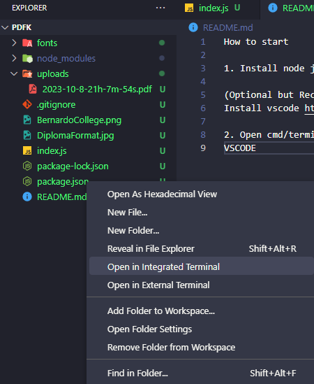
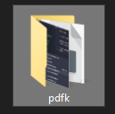
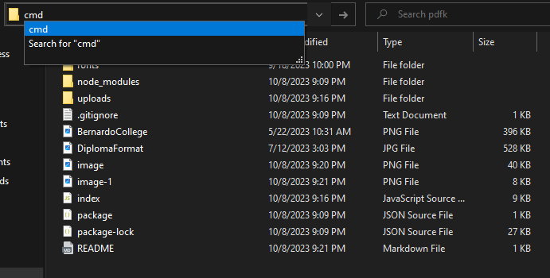
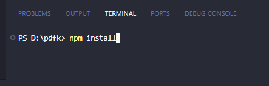
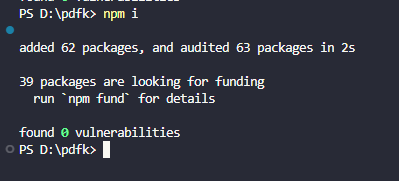
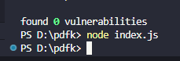
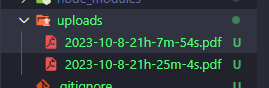

How to start

1. Install node js LTS https://nodejs.org/en

(Optional but Recommended)
Install vscode https://code.visualstudio.com/

2. Open cmd/terminal in folder location

VSCODE
Right click then open integrated terminal

or

File Explorer
Open folder 

Type cmd then enter

3. Type 'npm install'

4. Type 'node index.js' to run

then pdf will be created here
